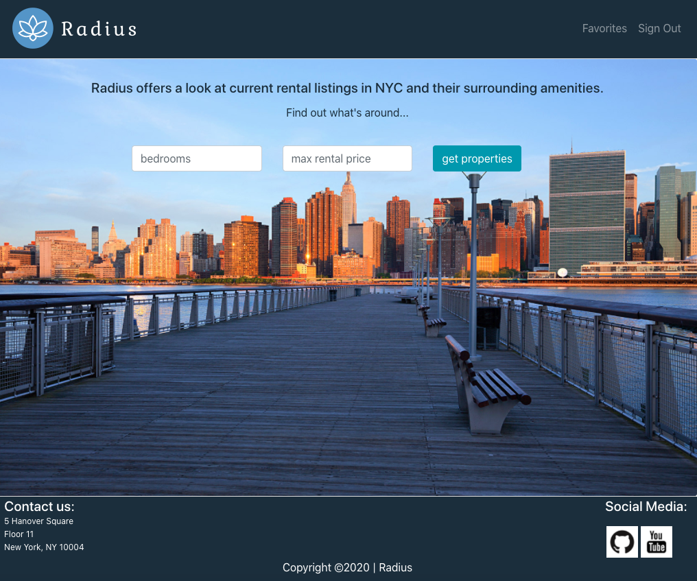

## Radius
[Radius](https://radius-ny.web.app/ target="blank") is a website that allows users to shop for rental properties and explore the nearby neighborhoods all in one place,
without navigating to different sites. You can view a video introduction [here](https://www.youtube.com/watch?v=Hraeg3iwS3U&feature=youtu.be).



## Technology
- FrontEnd: Javascript, React, Redux, Bootstrap, Google Javascript API, Realtor API
- BackEnd: Firebase

## Our Team Member
[Aminat Puebla](https://github.com/AminatP) | [Ioana Medvesan](https://github.com/imedvesan) | [Marta Mozelle](https://github.com/MozMM) | [Shirley Cheung](https://github.com/CTY315)

## Set Up
* Get a [Realtor API key](https://rapidapi.com/apidojo/api/realtor)
* Get a [Google Javascript API key](https://developers.google.com/maps/documentation/javascript/get-api-key)
* ```git clone https://github.com/2008-GH-Capstone-team-E/radius.git```
* Create a .gitignore file and put the above credentials in it
* ```npm install```
* ```npm start```

